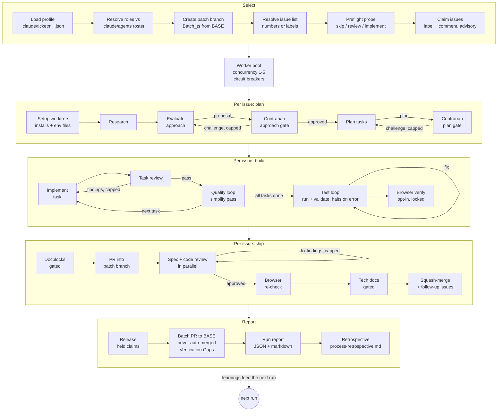

# Ticketmill Architecture

Ticketmill is a deterministic orchestration script (`workflows/ticketmill.js`) run
by the Claude Code Workflow tool. Control flow (loops, gates, caps, breakers) is
plain JavaScript; every unit of actual work is a schema-validated subagent call.

## Pipeline

## Design decisions

### One agent mechanism: persona-by-reference

Roles map to agent files in the target repo (`profile.roles`). A stage prompt
instructs its subagent to read `<root>/.claude/agents/<name>.md` first and adopt
the persona; unfilled roles get a built-in charter inlined. The engine never
passes `agentType`.

Why not use the registry when available and inline otherwise? Because the two
paths produce materially different agents (registry loads the file as a system
prompt; truncated inlining ships a near-generic one), and which path you got
would depend on whether the agent predated the session. Quality would vary
run-to-run for reasons invisible in any log. One mechanism keeps behavior
deterministic, makes freshly generated agents usable immediately, and costs one
extra file read per stage.

### The profile is required, and tests cannot be skipped silently

The original engine halts its test loop on errors because its CI did not run the
suite; a silent skip had shipped broken code. Porting that lesson to a
stack-agnostic engine means the engine must never guess a toolchain: a wrong
guess that finds no test command would skip verification and squash-merge
untested work behind a green-looking batch PR.

So: no profile, no run. `test_command` must be present as a key; `null` is legal
only as an explicit decision recorded by mill-init after asking the human. Every
skipped verification (null tests, missing agents, skipped browser checks) is
accumulated in `VERIFY_SKIPS` and rendered as a Verification Gaps section in the
batch PR body, which is the one artifact the reviewing human actually reads.

### mill-init owns environment proof

The doctor pass (scratch worktree, run installs + tests once) exists because a
profile that "looks right" but cannot boot the suite fails per-issue, inside the
test loop, at up to 10 iterations of model time per issue, looking like bad code
instead of a bad environment. mill-init converts that into a single onboarding
failure with an obvious cause, and records discovered preconditions in
`verify_notes` for the engine to inject into test/fix prompts.

### Invocation: scriptPath, with the engine copied into the target repo

Workflow scripts are not a registered plugin component (no `workflows` field in
plugin.json). mill-init therefore copies the engine into the target repo's
`.claude/workflows/` so runs work on any machine with the repo checked out,
plugin installed or not. The `mill` skill hard-stops when the Workflow tool is
unavailable and explicitly forbids simulating the pipeline inline: an imitation
run has no journal, no claims, no breakers, and no resumability, which is worse
than not running.

Because the engine now exists as two files that must stay byte-identical
(`workflows/ticketmill.js`, the source, and `.claude/workflows/ticketmill.js`,
the copy mill-init drops into target repos), `scripts/lint-engine.js` byte-compares
them on every test run and fails loud on drift. Edit only the source and copy it
over the `.claude` copy in the same commit; the two are never meant to diverge.

### Sandbox lint: catching rules `node --check` can't see

The Workflow tool sandbox forbids `Date.now()`, `Math.random()`, argless
`new Date()`, and any filesystem/Node API (`require`/`import`) inside the engine
script — all legal JavaScript, so `node --check` passes on every one of them,
but they throw at runtime and silently break resume (wall-clock time and
randomness aren't available in that sandbox; see the comments near the top of
`workflows/ticketmill.js`). That gap used to live only as tribal knowledge in
`verify_notes`. `scripts/lint-engine.js` makes it a mechanical, line-by-line text
scan wired into `test_command` right after `node --check`, so a violation fails
CI instead of a live run. Pure-comment lines are skipped (the engine's own docs
legitimately name these APIs), and a line carrying the literal `// sandbox-ok`
marker is the only escape hatch — deliberately narrower than a pattern-based
exception, so it has to be spelled out per line rather than silently suppressing
a whole rule.

### Batch branch model

`args.branch` (BASE) receives exactly one PR per run, created for a human.
Per-issue PRs squash-merge into `Batch_<timestamp>`; issue closure fires from the
batch PR's `Closes #N` lines when the human merges it. This keeps N issues'
worth of autonomous merges off the base branch while preserving per-issue review
trails.

### Incident-derived machinery (preserved from the source engine)

| Mechanism | Incident it answers |
|---|---|
| Scope guard + comment markers + misfiled-comment deletion | A concurrent pipeline posted one issue's plan onto another issue |
| Stub-task guard (`sanitizeTasks`) | A placeholder plan record shadowed a real plan and dispatched an empty task |
| Settled-decisions ledger | Contrarian gates oscillated (drop -> hardcode -> drop) across iterations, burning opus time re-litigating |
| "A finding is a hypothesis" in revision prompts | A wrong Major was adopted without verification, causing the oscillation above |
| Handoff notes ledger | Env workarounds were rediscovered from scratch several stages later |
| Test loop halts (never degrades) | Silent test skips shipped broken code |
| Claim protocol with label-safety rules | A claim agent once replaced an issue's full label set |
| Browser lock (mkdir + owner + stale-steal) | Concurrent agents hijacked each other's browser tabs |
| Degrade windows + circuit breakers | Distinguish one flaky stage from a systemic failure worth stopping for |

### Model policy

Judgment gates (evaluate, plan, contrarian challenges, final code review) default
to opus at high effort; workhorse implementation and reviews run sonnet;
mechanical probes and the test runner are haiku at low effort. Override any stage
via `profile.models`.

### Token tracking: instrumentation, never a gate

`stage()` samples the runtime's `budget.spent()` (cumulative output tokens for
the whole run) before and after each retry loop, attributing the delta to
`ctx.tokens.total` and `ctx.tokens.byModel[opts.model]`. That sampling sits in
its own `try/finally` wrapped around the existing retry loop. A tracking
failure, whether `budget.spent()` throws or the runtime hook is missing
outright, can never change `stage()`'s retry, STOP, or return behavior. This
is instrumentation, not a gate: a run with no working counter still ships,
just with "not tracked" standing in for the numbers instead of a false zero.

`aggregateTokens(results, spent, concurrency)` turns those per-issue deltas
into a "## Token Usage" section in plain JS. The pipeline injects the finished
markdown into the batch PR and run report prompts verbatim, so no subagent is
ever asked to sum or double-check the arithmetic. At concurrency 1, stage
deltas can't overlap, so they're an exact partition of the run: an
"orchestration/unattributed" remainder row (`spent` minus the summed deltas)
makes the table reconcile exactly to the run total. Above concurrency 1,
several issues' stages run against the same shared monotonic counter, and
`agent()` returns schema content only, never a per-call usage figure. There is
no way to split a shared counter's movement across concurrent callers, so the
whole breakdown is labeled approximate rather than claiming a precision it
doesn't have. Per-issue PR bodies get one line of the same figures (that
issue's stages only, not the run total).

Tokens only, never dollars: price varies by model and shifts over time, so no
currency figure appears anywhere in the engine, profile, or output. The
per-model-tier breakdown is what lets a human run that math outside the tool.

### Claims interop

Ticketmill honors fresh claims left by its ancestor engine ("## Batch Processing
Claimed" comments) as foreign claims, one-way, so both can coexist on a repo
during a migration without double-processing issues.

### Consolidation gate: grouping issues cheaper to resolve as one unit

Select can propose folding several selected issues into ONE worktree, branch,
research/plan pass, and PR when they share a subsystem and acceptance surface
(or an explicit dependency) closely enough that solving them separately would
duplicate work. This is a judgment call, not a heuristic: `proposeConsolidation()`
is an opus-tier gate, prompted with a deliberately conservative bar — grouping
is the exception, and shared files alone are never sufficient reason, only a
hint. The proposal then runs the same capped contrarian challenge pattern as
the approach/plan gates before it can take effect, reusing `CHALLENGE_SCHEMA`
and the settled-decisions ledger.

Everywhere else, the engine layers a group on top of the existing per-issue
path rather than replacing it: a unit is a singleton (`ctx.members = [ctx.issue]`,
the original code path verbatim) or a group (`ctx.members.length > 1`), so a
no-overlap run with zero proposed groups is byte-for-byte identical to the
engine before this gate existed. Grouping tags plan tasks by originating issue
(no synthesized merged-issue text); one primary issue carries the comment
trail while absorbed members get a "consolidated into #X" marker comment; the
group PR carries one `Closes #N` per member.

**Stable group id, not the mutable primary.** A group's physical identity
(worktree path, branch name, PR head) is bound to a `stableGroupId()` — the
lowest issue number ever in the group — rather than to whichever issue is
currently "primary." The two need to differ: claims settle after the proposal
is judged, so a proposed primary can turn out to be already claimed or to flip
to `skip` before materialization, forcing a re-anchor onto another live
member. If the physical identity had been hard-bound to the primary, re-anchoring
would mean silently moving a worktree/branch/PR that another process might
already be looking at. Binding identity to a stable id instead makes re-anchor
just a bookkeeping update: the same worktree and branch persist across a
primary change, and a resumed run's marker heal recognizes the group by that
id even after a re-anchor.

**Cap-dissolves, not proceed-with-caveats.** The approach and plan contrarian
gates proceed with unresolved caveats when the iteration cap is hit, because a
single issue still has to go somewhere. A consolidation proposal has a safe
fallback the others don't: independent per-issue processing, which is exactly
what the engine already does everywhere else. So hitting `MAX_CONTRARIAN_ITERATIONS`
on a group challenge, or a dead challenger/reviser mid-loop, DISSOLVES the
group back to its independent member issues instead of shipping a
still-contested grouping decision. Conservatism costs nothing here: dissolving
only forgoes an efficiency, it never blocks progress.

**Profile flag.** `profile.consolidation` (boolean, default `true`) disables
the gate entirely when set to `false` — no proposal, no contrarian challenge,
though a resumed run still heals any group a prior run already committed to
via its comment markers, so turning the flag off mid-run can't strand a group
that already exists on GitHub. Single-issue runs and runs with at most one
`implement`-bound candidate skip the gate for free (there is nothing to group).

**Billing anchor.** A group's tokens book under the primary issue, not spread
across members: `aggregateTokens()`'s per-issue breakdown keys off each
result's `issue` field, which for a group unit is `ctx.issue` — the
(possibly re-anchored) primary — so the run report's Token Usage table shows
one row for the whole group and absorbed members show no row of their own.

**Known gap — partial-branch members aren't excluded.** A member issue that
already has unmerged work sitting on its own `issue-<N>` branch
(`commits_ahead > 0` on its preflight) is not currently filtered out of
consolidation: `consolidationCandidates` only checks `resume_point`, and
`reconcileGroups()` only excludes members whose live `resume_point` isn't
`implement`, never on `commits_ahead`. If such an issue is folded into a
group, `setup-worktree.sh` runs against the group's `worktreeAnchor()`
instead of the member's own branch, so those pre-existing commits are not
carried forward — they are effectively orphaned rather than merged. This is
a known caveat, not yet a mechanical exclusion; treat an `implement`-bound
issue with nonzero `commits_ahead` as a poor consolidation candidate until
`consolidationCandidates`/`reconcileGroups` are extended to drop it.

## Failure semantics

- Stage dies twice -> the issue fails/halts at that stage with an issue comment
  carrying resume instructions; the claim is released.
- Three issue failures, or three consecutive agent deaths -> circuit breaker:
  remaining issues are marked `not_started`, the report carries a resume plan.
- Quality loop degrades (non-fatal) but 3 degrades in a rolling window of 5 halt
  the issue: that rate signals a systemic problem, not flakiness.
- Reviewer death at the PR gate -> `needs_human`, PR left open; reviewer death at
  the task gate -> provisional accept, flagged for extra PR-gate scrutiny.
- A failed consolidation group -> ONE circuit-breaker increment, not one per
  member (`fail()` runs exactly once per unit); every member issue's claim is
  released; each member gets its own resume comment naming the group and the
  failing stage, so any one member's trail is enough to understand the whole
  unit halted together. On resume, preflight healing recognizes the group from
  that comment's marker and re-proposes the SAME group rather than reprocessing
  its members as independent issues.
