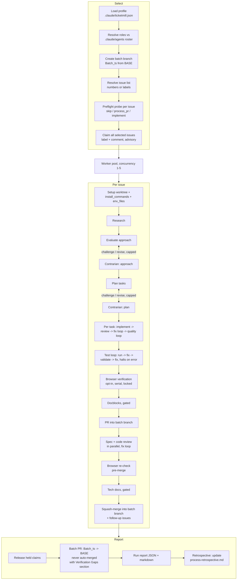

# Ticketmill Architecture

Ticketmill is a deterministic orchestration script (`workflows/ticketmill.js`) run
by the Claude Code Workflow tool. Control flow (loops, gates, caps, breakers) is
plain JavaScript; every unit of actual work is a schema-validated subagent call.

## Pipeline

## Design decisions

### One agent mechanism: persona-by-reference

Roles map to agent files in the target repo (`profile.roles`). A stage prompt
instructs its subagent to read `<root>/.claude/agents/<name>.md` first and adopt
the persona; unfilled roles get a built-in charter inlined. The engine never
passes `agentType`.

Why not use the registry when available and inline otherwise? Because the two
paths produce materially different agents (registry loads the file as a system
prompt; truncated inlining ships a near-generic one), and which path you got
would depend on whether the agent predated the session. Quality would vary
run-to-run for reasons invisible in any log. One mechanism keeps behavior
deterministic, makes freshly generated agents usable immediately, and costs one
extra file read per stage.

### The profile is required, and tests cannot be skipped silently

The original engine halts its test loop on errors because its CI did not run the
suite; a silent skip had shipped broken code. Porting that lesson to a
stack-agnostic engine means the engine must never guess a toolchain: a wrong
guess that finds no test command would skip verification and squash-merge
untested work behind a green-looking batch PR.

So: no profile, no run. `test_command` must be present as a key; `null` is legal
only as an explicit decision recorded by mill-init after asking the human. Every
skipped verification (null tests, missing agents, skipped browser checks) is
accumulated in `VERIFY_SKIPS` and rendered as a Verification Gaps section in the
batch PR body, which is the one artifact the reviewing human actually reads.

### mill-init owns environment proof

The doctor pass (scratch worktree, run installs + tests once) exists because a
profile that "looks right" but cannot boot the suite fails per-issue, inside the
test loop, at up to 10 iterations of model time per issue, looking like bad code
instead of a bad environment. mill-init converts that into a single onboarding
failure with an obvious cause, and records discovered preconditions in
`verify_notes` for the engine to inject into test/fix prompts.

### Invocation: scriptPath, with the engine copied into the target repo

Workflow scripts are not a registered plugin component (no `workflows` field in
plugin.json). mill-init therefore copies the engine into the target repo's
`.claude/workflows/` so runs work on any machine with the repo checked out,
plugin installed or not. The `mill` skill hard-stops when the Workflow tool is
unavailable and explicitly forbids simulating the pipeline inline: an imitation
run has no journal, no claims, no breakers, and no resumability, which is worse
than not running.

### Batch branch model

`args.branch` (BASE) receives exactly one PR per run, created for a human.
Per-issue PRs squash-merge into `Batch_<timestamp>`; issue closure fires from the
batch PR's `Closes #N` lines when the human merges it. This keeps N issues'
worth of autonomous merges off the base branch while preserving per-issue review
trails.

### Incident-derived machinery (preserved from the source engine)

| Mechanism | Incident it answers |
|---|---|
| Scope guard + comment markers + misfiled-comment deletion | A concurrent pipeline posted one issue's plan onto another issue |
| Stub-task guard (`sanitizeTasks`) | A placeholder plan record shadowed a real plan and dispatched an empty task |
| Settled-decisions ledger | Contrarian gates oscillated (drop -> hardcode -> drop) across iterations, burning opus time re-litigating |
| "A finding is a hypothesis" in revision prompts | A wrong Major was adopted without verification, causing the oscillation above |
| Handoff notes ledger | Env workarounds were rediscovered from scratch several stages later |
| Test loop halts (never degrades) | Silent test skips shipped broken code |
| Claim protocol with label-safety rules | A claim agent once replaced an issue's full label set |
| Browser lock (mkdir + owner + stale-steal) | Concurrent agents hijacked each other's browser tabs |
| Degrade windows + circuit breakers | Distinguish one flaky stage from a systemic failure worth stopping for |

### Model policy

Judgment gates (evaluate, plan, contrarian challenges, final code review) default
to opus at high effort; workhorse implementation and reviews run sonnet;
mechanical probes and the test runner are haiku at low effort. Override any stage
via `profile.models`.

### Claims interop

Ticketmill honors fresh claims left by its ancestor engine ("## Batch Processing
Claimed" comments) as foreign claims, one-way, so both can coexist on a repo
during a migration without double-processing issues.

## Failure semantics

- Stage dies twice -> the issue fails/halts at that stage with an issue comment
  carrying resume instructions; the claim is released.
- Three issue failures, or three consecutive agent deaths -> circuit breaker:
  remaining issues are marked `not_started`, the report carries a resume plan.
- Quality loop degrades (non-fatal) but 3 degrades in a rolling window of 5 halt
  the issue: that rate signals a systemic problem, not flakiness.
- Reviewer death at the PR gate -> `needs_human`, PR left open; reviewer death at
  the task gate -> provisional accept, flagged for extra PR-gate scrutiny.
