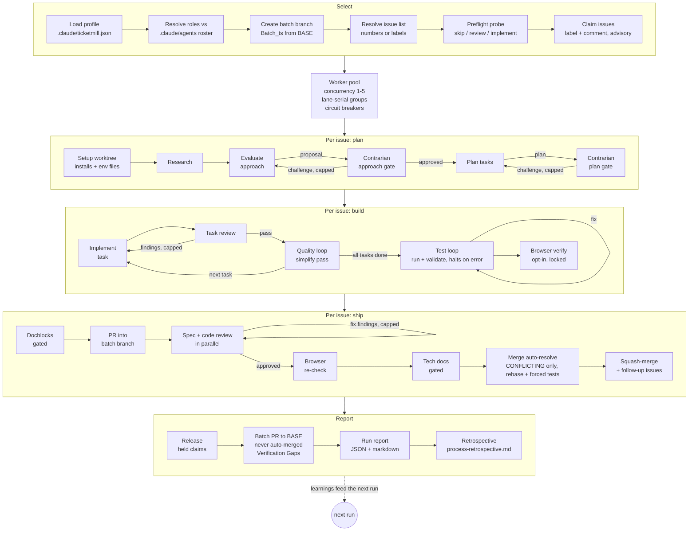

# Ticketmill Architecture

Ticketmill is a deterministic orchestration script (`workflows/ticketmill.js`) run
by the Claude Code Workflow tool. Control flow (loops, gates, caps, breakers) is
plain JavaScript; every unit of actual work is a schema-validated subagent call.

## Pipeline

## Design decisions

### One agent mechanism: persona-by-reference

Roles map to agent files in the target repo (`profile.roles`). A stage prompt
instructs its subagent to read `<root>/.claude/agents/<name>.md` first and adopt
the persona; unfilled roles get a built-in charter inlined. The engine never
passes `agentType`.

Why not use the registry when available and inline otherwise? Because the two
paths produce materially different agents (registry loads the file as a system
prompt; truncated inlining ships a near-generic one), and which path you got
would depend on whether the agent predated the session. Quality would vary
run-to-run for reasons invisible in any log. One mechanism keeps behavior
deterministic, makes freshly generated agents usable immediately, and costs one
extra file read per stage.

### The profile is required, and tests cannot be skipped silently

The original engine halts its test loop on errors because its CI did not run the
suite; a silent skip had shipped broken code. Porting that lesson to a
stack-agnostic engine means the engine must never guess a toolchain: a wrong
guess that finds no test command would skip verification and squash-merge
untested work behind a green-looking batch PR.

So: no profile, no run. `test_command` must be present as a key; `null` is legal
only as an explicit decision recorded by mill-init after asking the human. Every
skipped verification (null tests, missing agents, skipped browser checks) is
accumulated in `VERIFY_SKIPS` and rendered as a Verification Gaps section in the
batch PR body, which is the one artifact the reviewing human actually reads.

### mill-init owns environment proof

The doctor pass (scratch worktree, run installs + tests once) exists because a
profile that "looks right" but cannot boot the suite fails per-issue, inside the
test loop, at up to 10 iterations of model time per issue, looking like bad code
instead of a bad environment. mill-init converts that into a single onboarding
failure with an obvious cause, and records discovered preconditions in
`verify_notes` for the engine to inject into test/fix prompts.

### Invocation: scriptPath, with the engine copied into the target repo

Workflow scripts are not a registered plugin component (no `workflows` field in
plugin.json). mill-init therefore copies the engine into the target repo's
`.claude/workflows/` so runs work on any machine with the repo checked out,
plugin installed or not. The `mill` skill hard-stops when the Workflow tool is
unavailable and explicitly forbids simulating the pipeline inline: an imitation
run has no journal, no claims, no breakers, and no resumability, which is worse
than not running.

Because the engine now exists as two files that must stay byte-identical
(`workflows/ticketmill.js`, the source, and `.claude/workflows/ticketmill.js`,
the copy mill-init drops into target repos), `scripts/lint-engine.js` byte-compares
them on every test run and fails loud on drift. Edit only the source and copy it
over the `.claude` copy in the same commit; the two are never meant to diverge.

### Sandbox lint: catching rules `node --check` can't see

The Workflow tool sandbox forbids `Date.now()`, `Math.random()`, argless
`new Date()`, and any filesystem/Node API (`require`/`import`) inside the engine
script — all legal JavaScript, so `node --check` passes on every one of them,
but they throw at runtime and silently break resume (wall-clock time and
randomness aren't available in that sandbox; see the comments near the top of
`workflows/ticketmill.js`). That gap used to live only as tribal knowledge in
`verify_notes`. `scripts/lint-engine.js` makes it a mechanical, line-by-line text
scan wired into `test_command` right after `node --check`, so a violation fails
CI instead of a live run. Pure-comment lines are skipped (the engine's own docs
legitimately name these APIs), and a line carrying the literal `// sandbox-ok`
marker is the only escape hatch — deliberately narrower than a pattern-based
exception, so it has to be spelled out per line rather than silently suppressing
a whole rule.

### Batch branch model

`args.branch` (BASE) receives exactly one PR per run, created for a human.
Per-issue PRs squash-merge into `Batch_<timestamp>`; issue closure fires from the
batch PR's `Closes #N` lines when the human merges it. This keeps N issues'
worth of autonomous merges off the base branch while preserving per-issue review
trails.

### Closes lines: keyed off shipped issues, not raw completion status

The batch PR's `Closes #N` lines used to come straight from `results.filter(r
=> r.status === 'completed')`. That's correct for a single, unbroken pass, but
it breaks on a healing or resumed run. An issue whose per-issue PR already
merged into TARGET during a PRIOR pass preflights this pass as `status:
'skipped'` (a related PR is already merged, so Select routes it straight to
`resume_point: 'skip'`). Filtering on `completed` alone drops that issue from
the Closes lines silently, and it stays open when the human merges the batch
PR.

`batchClosesIssues(results)` fixes this by keying inclusion on a `shipped` set
instead of raw status: an issue counts as shipped when `status ===
'completed'`, or when `status === 'skipped'` and `merged_into_target ===
true`. `merged_into_target` is computed in JS at the `resume_point === 'skip'`
return, as `pre.pr_state === 'merged' && pre.pr_base === TARGET`. That's a
plain string match against TARGET, the one value in scope that's
authoritative about which batch branch this run owns. It guards the
mirror-image bug too: a PR merged into a DIFFERENT batch branch, a
concurrent run's own TARGET or straight into BASE, must not count as shipped
into this one. `pr_base` is a new preflight schema field, read from `gh pr
list --json ...,baseRefName` at probe time alongside the existing `pr_state`.

`batchClosesIssues` flatMaps over each result's `members` (falling back to
`[r.issue]` when the result isn't grouped) and dedups, so a shipped
consolidation group still closes every member, not just its primary. The
same `shippedIssues` set now drives the batch PR's create/update gate, the
title's issue count, and the "## Consolidated Groups" section as well as the
Closes lines, so a resumed pass can't rebuild one of those four pieces
in a way that disagrees with the other three.

### Merge auto-resolve: one mechanical recovery attempt before needs_human

A PR whose preflight reads `CONFLICTING` used to escalate straight to
`needs_human`, even when the conflict was mechanical: a sibling issue's
commits already landed on the batch branch, or two hunks that just don't
overlap. `runMergeAutoResolve(ctx)` runs immediately before the merge stage
and gives that case one recovery attempt first. It follows the same shape as
`runBrowserCheck`: a probe decides whether to act at all, then a bounded chain
of mechanical git stages plus one judgment stage does the work.

The probe reads mergeability through `mergeSettlePoll`, a shared bash loop
(up to 6 polls, 5 seconds apart) rather than one read. GitHub recomputes
`mergeable: UNKNOWN` asynchronously for a few seconds after a push, so a
single read can misjudge a perfectly fine PR as unresolvable. The merge
stage's own preflight polls the same way right before it merges, for the same
reason.

Only `CONFLICTING` triggers the rest of the flow. On that state, the still-open
worktree fetches and rebases onto the batch branch's current tip. A clean
rebase counts as resolved too, even with zero conflicts, because the merged
diff still differs from the head that spec and code review actually looked
at. Surviving conflicts go to an implementer-persona resolver stage that
prefers keeping both sides of a hunk over discarding either, since the other
side is almost always a sibling issue's change already on the batch branch.
A hunk that needs a semantic judgment call aborts the rebase instead of
guessing.

Every rebase, resolved or clean, is followed by a mandatory, forced run of
`runTestLoop(ctx, true)`. The `forced` flag skips the loop's usual "no
testable code changed" shortcut. It exists to answer one narrow question:
does the exact tree about to be force-pushed pass. A rebase can pull in
commits whose diff looks unchanged against the target while the tree that
would actually get pushed has moved.

A thrash guard runs right after: it checks the batch branch hasn't moved
again while those tests were running. If it has, the state that just went
green is already stale. The flow escalates instead of silently re-rebasing
and pushing content the tests never verified, bumping
`ctx.metrics.merge_thrash`. An earlier draft of this flow re-rebased and
pushed at that point instead; the guard is a deliberate, contrarian-adjudicated
reversal of that choice. The final push uses `--force-with-lease`, never a
plain `--force`, so a stale lease from concurrent access fails loud instead of
clobbering someone else's push.

Gated on a real `test_command`: with `test_command: null` there's no suite to
re-verify against, so the safety property this flow exists to provide doesn't
apply. A `CONFLICTING` PR under a no-test profile falls straight through to
the merge stage's own preflight, unchanged, exactly as before this mechanism
existed.

`ctx.metrics.merge_auto_resolved` increments only after the merge stage's own
subsequent preflight confirms a real merge. The force-push alone never bumps
it, so a PR that auto-resolve fixed but that then blocks at the merge stage
for an unrelated reason can't inflate the count. When the merge does go through,
the Implementation Complete comment says explicitly that the merged diff
diverged from the head spec and code review reviewed.

`aggregateMergeAutoResolve(results)` rolls the per-issue metrics up into a
"## Merge Auto-Resolution" section for the batch PR body and the run report,
following the same JS-computed, verbatim-injected pattern as
`aggregateTokens` below: no subagent ever sums or double-checks this
arithmetic. It reads `merge_auto_resolved` and `merge_thrash` off every
result, including a `needs_human` result the thrash guard escalated, since
`fail()` carries `ctx.metrics` through. The two counts never overlap: a
thrashed issue escalates before it can also count as resolved.

### Engine-owned path guardrail: three regimes

A worktree only sees committed state. A freshly forged agent file, or a
profile field just added at the repo root, stays invisible there until it's
committed. An implementer that "reconciles" what looks like a stale diff in
the worktree can restore the old committed version straight from git
history. A later batch merge then overwrites the uncommitted root-tree work
without ever raising a conflict: that's nonconvexlabs-com#77, the incident
this guardrail exists to close.

Engine-owned paths are the run's own tooling: the ticketmill profile
(`.claude/ticketmill.json`), the agent roster (`.claude/agents/**`), and the
engine's own installed copy (`.claude/workflows/ticketmill.js`,
`.claude/scripts/ticketmill/**`). A profile can extend that default set via
`profile.engine_owned_globs`. These paths stay read-only for a run unless an
issue's own title or body plainly names one of them.

Three regimes cover what happens next.

**(a) Select-phase skip.** When an issue's prose names an engine-owned path
(`engineOwnedHit`, a case-sensitive substring match) and the preflight probe
finds the root tree already dirty under that same path
(`root_dirty_engine_paths`), the issue is routed straight to `resume_point:
skip` before a worktree is ever built. This is the only regime the engine
can catch ahead of time, and only because git tracks the dirt: an
uncommitted rename or a change outside git's view still slips through.

**(b) Deliberate engine work, clean root.** An issue whose prose names an
engine-owned path, with a clean root tree, is intentional engine work: this
repo's own ticketmill issues look exactly like this. `ctx.engineOwnedIntentional`
is computed once at Select from title and body, then OR-folded across a
consolidation group's live members in `deriveUnits()` so a non-primary
group member's intent survives `pickPrimary`'s unrelated choice of primary.
The post-implement gate reads that flag and leaves the diff exactly as
committed.

**(c) Incidental change.** Engine-owned paths turn up in the diff, but
nothing in the issue's prose named them. `runEngineOwnedGate(ctx)` runs
right before the test loop, not after like `runBrowserCheck`, so a revert it
triggers gets re-validated by that same run's test suite in-band rather than
landing unverified. A deterministic JS pass filters the diff against the
engine-owned set, then splits it again with `isHardRevertPath`: a
single-purpose stage hard-reverts every path that isn't also listed in
`profile.lockstep_installed_paths`, committing and pushing the revert. A
lockstep path is exempt because it's a deliberate installed copy of a
source-of-truth file elsewhere in the repo, kept in sync by the repo's own
tooling: this repo sets `[".claude/workflows/ticketmill.js"]`, since
`scripts/lint-engine.js` already keeps it byte-identical to
`workflows/ticketmill.js`. Reverting a lockstep path here would fight that
sync instead of undoing an incidental restore, so any drift on that path is
left for `lint-engine`'s byte-compare to catch on its own.

Checkout alone doesn't cover every case. `git checkout origin/<TARGET> --
<path>` fails with "pathspec did not match any file(s)" on a path absent
from the baseline: a file created fresh on the branch. Checkout restores
from a baseline copy, and a created file has none. So the diff probe also
returns `added_files`, from a second `--diff-filter=A` command, and
`runEngineOwnedGate` partitions `revertFiles` against that list:
`createdFiles` get `git rm`, `existingFiles` still go through checkout, and
both commands land in the same revert commit. An older or degraded probe
response can omit `added_files`, since the schema field is optional.
`createdFiles` then stays empty, and every path falls into the checkout
group, reproducing the prior behavior: checkout fails on the missing
pathspec, and the gate degrades to a recorded `ctx.deferred` follow-up
instead of blocking the issue.

`scopeGuard()` carries a fourth, advisory layer on top of the two gates
above: a clause appended to every stage prompt, unconditionally, telling the
agent never to stage, commit, or restore an engine-owned path outside these
mechanisms. It has to stay generic rather than naming a regime, since an
agent mid-stage has no reliable way to know which one it's in. The one
stage that's deliberately excused from that clause is the regime (c) revert
stage itself: its prompt opens with an explicit override, because it is the
guardrail acting on the agent's behalf, ahead of the checkout instruction
the general clause would otherwise contradict.

The gate never halts a run on its own. A dead diff probe or a failed revert
stage degrades to a recorded `ctx.deferred` follow-up instead of blocking an
otherwise-green issue.

### Incident-derived machinery (preserved from the source engine)

| Mechanism | Incident it answers |
|---|---|
| Scope guard + comment markers + misfiled-comment deletion | A concurrent pipeline posted one issue's plan onto another issue |
| Stub-task guard (`sanitizeTasks`) | A placeholder plan record shadowed a real plan and dispatched an empty task |
| Settled-decisions ledger | Contrarian gates oscillated (drop -> hardcode -> drop) across iterations, burning opus time re-litigating |
| "A finding is a hypothesis" in revision prompts | A wrong Major was adopted without verification, causing the oscillation above |
| Handoff notes ledger | Env workarounds were rediscovered from scratch several stages later |
| Test loop halts (never degrades) | Silent test skips shipped broken code |
| Claim protocol with label-safety rules | A claim agent once replaced an issue's full label set |
| Browser lock (mkdir + owner + stale-steal) | Concurrent agents hijacked each other's browser tabs |
| Degrade windows + circuit breakers | Distinguish one flaky stage from a systemic failure worth stopping for |
| `isBudgetExhaustedError` noun+verb match | A bare keyword sweep on "budget"/"ceiling" matched a target repo's own domain errors, misreporting an ordinary agent death as token exhaustion and halting every remaining issue |

### Model policy

Judgment gates (evaluate, plan, contrarian challenges, final code review) default
to opus at high effort; workhorse implementation and reviews run sonnet;
mechanical probes and the test runner are haiku at low effort. Override any stage
via `profile.models`.

### Token tracking: instrumentation, never a gate

`stage()` samples the runtime's `budget.spent()` (cumulative output tokens for
the whole run) before and after each retry loop, attributing the delta to
`ctx.tokens.total` and `ctx.tokens.byModel[opts.model]`. That sampling sits in
its own `try/finally` wrapped around the existing retry loop. A tracking
failure, whether `budget.spent()` throws or the runtime hook is missing
outright, can never change `stage()`'s retry, STOP, or return behavior. This
is instrumentation, not a gate: a run with no working counter still ships,
just with "not tracked" standing in for the numbers instead of a false zero.

`aggregateTokens(results, spent, concurrency)` turns those per-issue deltas
into a "## Token Usage" section in plain JS. The pipeline injects the finished
markdown into the batch PR and run report prompts verbatim, so no subagent is
ever asked to sum or double-check the arithmetic. At concurrency 1, stage
deltas can't overlap, so they're an exact partition of the run: an
"orchestration/unattributed" remainder row (`spent` minus the summed deltas)
makes the table reconcile exactly to the run total. Above concurrency 1,
several issues' stages run against the same shared monotonic counter, and
`agent()` returns schema content only, never a per-call usage figure. There is
no way to split a shared counter's movement across concurrent callers, so the
whole breakdown is labeled approximate rather than claiming a precision it
doesn't have. Per-issue PR bodies get one line of the same figures (that
issue's stages only, not the run total).

Tokens only, never dollars: price varies by model and shifts over time, so no
currency figure appears anywhere in the engine, profile, or output. The
per-model-tier breakdown is what lets a human run that math outside the tool.

### Budget-exhaustion detection: a noun+verb match, not a keyword sweep

`isBudgetExhaustedError(msg)` decides what a caught stage error means: real
runtime token exhaustion, which trips the whole-run `tripStop()`, or an
ordinary per-attempt death, which retries and then falls through to
`recordAgentDeath()`. It used to fire on a bare keyword sweep: any message
containing "budget", "token target", or "ceiling" tripped the whole run.
That caught more than exhaustion. A target repo's own domain error, a
"budget" feature or a "ceiling" config value, matched the same sweep with
nothing to do with tokens. An ordinary agent death got misreported as
exhaustion, and the whole batch halted with every remaining issue left
unstarted.

The check now requires a budget/token/ceiling noun to co-occur with an
exhaustion-shaped verb: exhaust, exceed, deplete, ran out, overrun/overage,
went over, ran over, over budget, over the limit, or limit reached. Either
alone isn't enough. The "over" family is anchored to those overrun-shaped
phrases rather than the bare word "over", which turns up in ordinary prose
("budget review is over") without meaning exhaustion.

Anchoring to the runtime's exact exhaustion error string was rejected: that
text isn't documented anywhere accessible, and the runtime's budget object
exposes only `.spent()`, no `.remaining()` and no structured error field. A
wrong guess would silently disable real exhaustion detection, so the match
stays semantic instead. `recordAgentDeath()`'s existing three-consecutive-
death circuit breaker is the backstop for any true exhaustion the tightened
match still misses.

### Claims interop

Ticketmill honors fresh claims left by its ancestor engine ("## Batch Processing
Claimed" comments) as foreign claims, one-way, so both can coexist on a repo
during a migration without double-processing issues.

### Consolidation gate: grouping issues cheaper to resolve as one unit

Select can propose folding several selected issues into ONE worktree, branch,
research/plan pass, and PR when they share a subsystem and acceptance surface
(or an explicit dependency) closely enough that solving them separately would
duplicate work. This is a judgment call, not a heuristic: `proposeConsolidation()`
is an opus-tier gate, prompted with a deliberately conservative bar. Grouping
is the exception. Shared files alone are never sufficient reason, only a
hint. The proposal then runs the same capped contrarian challenge pattern as
the approach/plan gates before it can take effect, reusing `CHALLENGE_SCHEMA`
and the settled-decisions ledger.

Everywhere else, the engine layers a group on top of the existing per-issue
path rather than replacing it: a unit is a singleton (`ctx.members = [ctx.issue]`,
the original code path verbatim) or a group (`ctx.members.length > 1`), so a
no-overlap run with zero proposed groups is byte-for-byte identical to the
engine before this gate existed. Grouping tags plan tasks by originating issue
(no synthesized merged-issue text); one primary issue carries the comment
trail while absorbed members get a "consolidated into #X" marker comment; the
group PR carries one `Closes #N` per member.

**Stable group id, not the mutable primary.** A group's physical identity
(worktree path, branch name, PR head) is bound to a `stableGroupId()`: the
lowest issue number ever in the group, rather than to whichever issue is
currently "primary." The two need to differ: claims settle after the proposal
is judged, so a proposed primary can turn out to be already claimed or to flip
to `skip` before materialization, forcing a re-anchor onto another live
member. If the physical identity had been hard-bound to the primary, re-anchoring
would mean silently moving a worktree/branch/PR that another process might
already be looking at. Binding identity to a stable id instead makes re-anchor
just a bookkeeping update: the same worktree and branch persist across a
primary change, and a resumed run's marker heal recognizes the group by that
id even after a re-anchor.

**Cap-dissolves, not proceed-with-caveats.** The approach and plan contrarian
gates proceed with unresolved caveats when the iteration cap is hit, because a
single issue still has to go somewhere. A consolidation proposal has a safe
fallback the others don't: independent per-issue processing, which is exactly
what the engine already does everywhere else. So hitting `MAX_CONTRARIAN_ITERATIONS`
on a group challenge, or a dead challenger/reviser mid-loop, DISSOLVES the
group back to its independent member issues instead of shipping a
still-contested grouping decision. Conservatism costs nothing here: dissolving
only forgoes an efficiency, it never blocks progress.

**Profile flag.** `profile.consolidation` (boolean, default `true`) disables
the gate entirely when set to `false`. No proposal runs and no contrarian
challenge runs, though a resumed run still heals any group a prior run already
committed to via its comment markers, so turning the flag off mid-run can't
strand a group that already exists on GitHub. Runs with at most one candidate
issue (any resume_point) skip the gate for free: there is nothing to group.
Only fresh `implement`-bound candidates are ever offered to the opus PROPOSE
step for a brand-new grouping decision; the marker HEAL step runs over every
candidate regardless of resume_point (see below).

**Billing anchor.** A group's tokens book under the primary issue, not spread
across members: `aggregateTokens()`'s per-issue breakdown keys off each
result's `issue` field, which for a group unit is `ctx.issue`. That's the
(possibly re-anchored) primary, so the run report's Token Usage table shows
one row for the whole group and absorbed members show no row of their own.

**Resumed groups stay grouped across every live resume_point.**
`proposeConsolidation()` is handed EVERY selected issue's preflight, not just
`implement`-bound ones, so its HEAL step can recognize a group whose members
have since flipped to `process_pr` (the shared PR already exists: a prior run
created it but crashed or failed before merging, in `reviewAndMerge`, which
covers spec review, code review, and merge) or `skip` (one member resolved
independently). `reconcileGroups()` keeps a member live, and IN the group,
when its resume_point is `implement` OR `process_pr`; only `skip` excludes it.
That is what keeps a post-PR-crash resume routing the whole group through ONE
`process_pr` unit (one worktree, one `reviewAndMerge` call on the shared PR)
instead of splintering into one independent `process_pr` singleton per
member, each attempting to review/merge the SAME PR.

**Known gap: partial-branch members aren't excluded.** A member issue that
already has unmerged work sitting on its own `issue-<N>` branch
(`commits_ahead > 0` on its preflight) is not currently filtered out of
consolidation: neither `consolidationCandidates` nor `reconcileGroups()` checks
`commits_ahead`. If such an issue is folded into a group, `setup-worktree.sh`
runs against the group's `worktreeAnchor()` instead of the member's own
branch, so those pre-existing commits are not carried forward. They are
effectively orphaned rather than merged. This is a known caveat, not yet a
mechanical exclusion; treat an `implement`-bound issue with nonzero
`commits_ahead` as a poor consolidation candidate until `reconcileGroups` is
extended to drop it.

### Lane scheduling: serializing issues with predicted file conflicts

Concurrent issues that touch the same file race by default: two implementers
land conflicting edits, and review has to reconcile a diff nobody expected.
Lane scheduling groups issues likely to overlap into one lane, and a single
worker drains that lane serially instead of racing every unit against the
whole pool.

**Predictions come from preflight, not a title heuristic.** Each preflight
probe resolves real repo-relative paths against `origin/TARGET` (fetched once
up front, shared read-only across every issue's probe rather than refetched
per issue) and reads `depends_on #N` / `follow-up to #N` references out of
the issue body. Both fields fail open to `[]` on any doubt. A wrong guess
would wrongly serialize two unrelated issues; an empty prediction only costs
the batch today's ordinary racing behavior.

**`computeLanes()` is a union-find over predicted-file overlap, with two edge
tiers.** Trusted edges, a `serialize_globs` pattern hit or a `depends_on`
reference, always unite their units and are never dissolved. Heuristic
edges, a shared predicted path or (only when no path matches) a shared
basename, unite units too, but only survive a cohesion-aware collapse guard.
A pair sharing two or more distinct paths is a genuine cluster, an
implementation file plus its test, say, and always stands. A pair sharing
exactly one path only survives as part of a weak-edge-only chain that
reaches two distinct shared keys entirely on its own, never inherited from a
neighboring strong cluster. A single popular path touched by many otherwise
unrelated units, a magnet config or a central router, can't drag them into
one lane by itself. That's the failure mode the guard exists to catch: one
file everyone happens to touch is not evidence that any two of them conflict.

**Document frequency is advisory, never a filter.** A path matched by more
than half the batch (minimum 3 units) gets logged as a magnet signal, for
visibility in run logs and the DRY_RUN preview. It never drops an
intersection key or suppresses an edge; only the collapse guard does that.

**A second, coarser guard runs immediately before the real drain.**
`computeLanes()` guards each weak-edge chain locally, but a long run of
pairwise-weak edges, each sharing a different path with its neighbor, can
clear that local two-distinct-keys bar in aggregate without the lane, taken
as a whole, actually cohering around anything. `applyRealRunCollapseGuard()`
only recomputes when the batch is large enough to want the concurrency
(`unitCount >= concurrency`) and the lanes produced are running noticeably
narrower than a flat pool would (`collapse_ratio < 0.5`). A lane whose exact
membership also comes out of `computeLanes({ trustedOnly: true })` is
trusted and always kept. Everything else is re-checked whole-lane, fresh,
for at least two paths shared across its own units, and dissolved back to
one singleton lane per unit if it doesn't clear that bar.

**`runPool()` steals whole lanes, not items.** A worker grabs the next
unclaimed lane and drains every unit in it one at a time, in `depends_on`
topological order, before stealing another lane. No `lanes` argument, or
every lane a singleton (what `computeLanes()` returns when nothing
overlaps), degenerates byte-for-byte to the pre-lane pool: one lane per item,
drained in original order, `min(limit, items.length)` workers. STOP is still
checked per unit, and a thrown error is still isolated to the one unit that
threw, so lane draining changes nothing about failure isolation or
resumability.

**DRY_RUN previews the same lane graph, read-only.** The claim loop never
runs during a preview, so a preview's lanes can still diverge from a real
run's if a claim race flips a `resume_point` between the two. The preview
reports each lane's issues, predicted files, and provenance (`trusted`,
`heuristic`, or `none` for an unconnected singleton), plus `collapse_ratio`,
`prediction_coverage`, any DF-flagged magnet paths, and whether the shared
`origin/TARGET` fetch failed, which would mean every prediction in the
preview is grounded against a stale ref.

**The retrospective measures its own accuracy.** For each completed unit
that predicted files and produced a merged PR, the retro agent diffs the
PR's actual changed files against `predicted_files` and appends one
coverage/precision row to a new "## Lane Prediction Accuracy" section in
`process-retrospective.md`. That closes the loop: the same memory file a
human reads to judge whether the prediction step is worth trusting, or needs
a `serialize_globs` hint for a repo's actual magnet files.

**Bounds are read-only aids, not correctness inputs.** A lane's merged
`predicted_files` list caps at `MAX_LANE_PREDICTED_FILES` (60); the retro's
predicted-vs-actual sample caps at `MAX_LANE_ACCURACY_SAMPLES` (40). Both
only limit what a human or a prompt sees, never what `computeLanes()` unions
or what `runPool()` drains.

**Profile flag.** `serialize_globs` (optional, default `[]`) names patterns
worth trusting even when predicted-file overlap alone wouldn't catch them: a
shared schema, a central config, anything two issues could conflict on
without their own predicted paths overlapping. Left unset, the engine still
lanes on `depends_on` and predicted-file overlap alone.

## Failure semantics

- Stage dies twice -> the issue fails/halts at that stage with an issue comment
  carrying resume instructions; the claim is released.
- Three issue failures, or three consecutive agent deaths -> circuit breaker:
  remaining issues are marked `not_started`, the report carries a resume plan.
- Quality loop degrades (non-fatal) but 3 degrades in a rolling window of 5 halt
  the issue: that rate signals a systemic problem, not flakiness.
- Reviewer death at the PR gate -> `needs_human`, PR left open; reviewer death at
  the task gate -> provisional accept, flagged for extra PR-gate scrutiny.
- A failed consolidation group -> ONE circuit-breaker increment, not one per
  member (`fail()` runs exactly once per unit); every member issue's claim is
  released; each member gets its own resume comment naming the group and the
  failing stage, so any one member's trail is enough to understand the whole
  unit halted together. On resume, preflight healing recognizes the group from
  that comment's marker and re-proposes the SAME group rather than reprocessing
  its members as independent issues.
