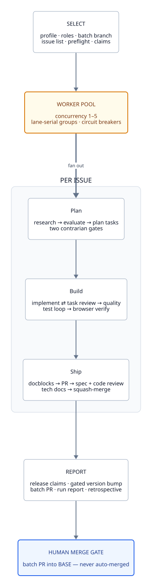
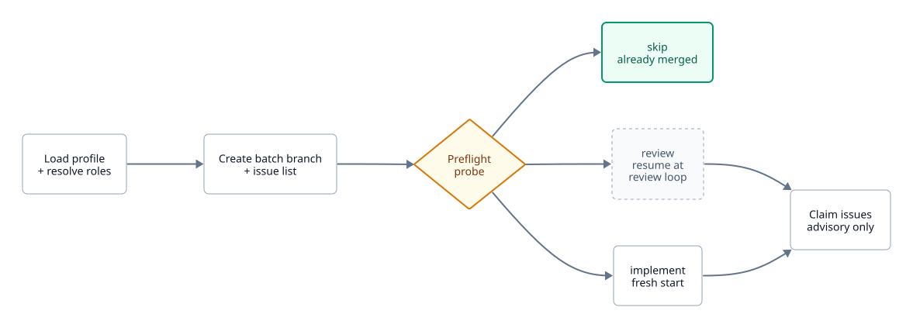
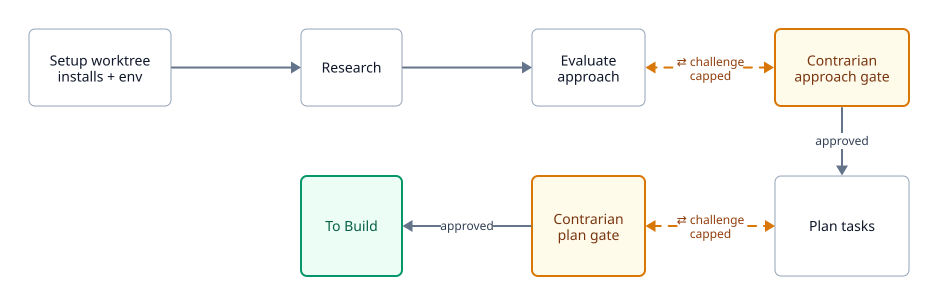
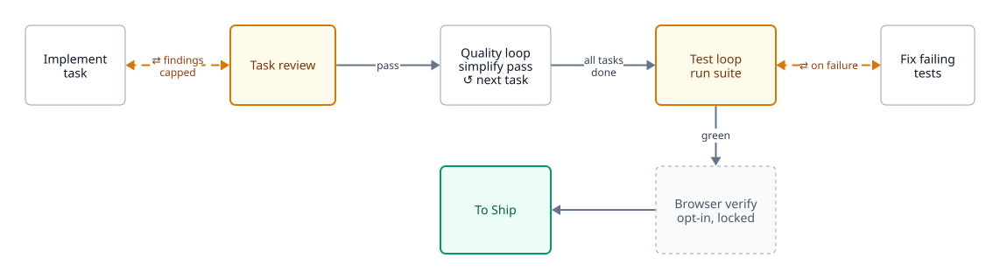
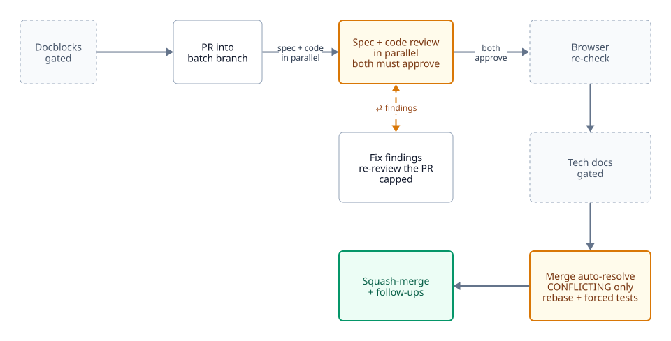
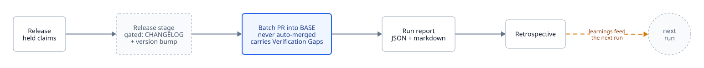

# Pipeline

<picture>
  <source media="(prefers-color-scheme: dark)" srcset="../diagrams/pipeline-overview-dark.svg">
  
</picture>

Diagram sources live in [`docs/diagrams`](../diagrams) as [D2](https://d2lang.com)
and render to the SVG pairs above via `docs/diagrams/render.sh`. Edit the `.d2`
files and re-run that script. The SVGs are generated, so don't hand-edit them.

Shape and color carry meaning across every diagram below:

| | Meaning |
| --- | --- |
| Plain box | An ordinary stage: one schema-validated subagent call |
| Amber box | A gate or a capped loop: somewhere the run can iterate or stall |
| Dashed box | An optional stage, gated on profile config, skipped by default |
| Green box | A terminal state for that phase |
| Blue box | The one place a human is required |
| Dashed amber edge | A backward edge: rework, re-review, or a retry |

## Select

Runs once, before any worker starts.

<picture>
  <source media="(prefers-color-scheme: dark)" srcset="../diagrams/phase-select-dark.svg">
  
</picture>

The preflight probe decides where each issue re-enters the pipeline. That keeps
a healing or resumed run cheap: an issue whose PR already merged into this
batch branch costs one probe instead of a full pass. The three resume points
are:

- **skip**: a related PR already merged into this batch branch. The issue is
  done, but it still counts toward the batch PR's `Closes` lines.
- **review**: a PR is open. The issue resumes at the review loop rather than
  re-implementing work that already exists.
- **implement**: nothing exists yet, so the issue runs the full pipeline.

Only `review` and `implement` claim the issue. Claims are advisory: a label
plus a comment. Nothing about them locks the issue.

## Plan

<picture>
  <source media="(prefers-color-scheme: dark)" srcset="../diagrams/phase-plan-dark.svg">
  
</picture>

Both contrarian gates are iteration-capped. Hitting a cap with findings still
open is never silent. It accumulates into `VERIFY_SKIPS` and surfaces in the
batch PR's Verification Gaps section.

## Build

<picture>
  <source media="(prefers-color-scheme: dark)" srcset="../diagrams/phase-build-dark.svg">
  
</picture>

The test loop halts the issue on error rather than skipping verification. That
is why `test_command` must be present in the profile as an explicit key.

## Ship

<picture>
  <source media="(prefers-color-scheme: dark)" srcset="../diagrams/phase-ship-dark.svg">
  
</picture>

The per-issue PR merges into the batch branch, never into BASE. Merge
auto-resolve gets one mechanical recovery attempt on a `CONFLICTING` PR before
the issue escalates to `needs_human`.

## Report

<picture>
  <source media="(prefers-color-scheme: dark)" srcset="../diagrams/phase-report-dark.svg">
  
</picture>

The batch PR is the one artifact a human is guaranteed to read. It carries the
Verification Gaps section, the merge auto-resolution tally, and the friction
and churn rollup.
